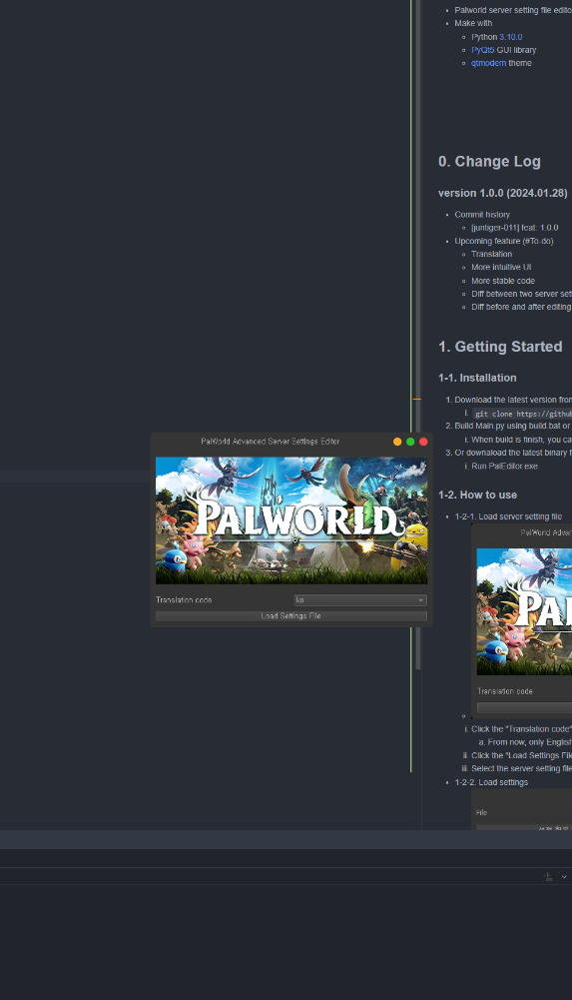
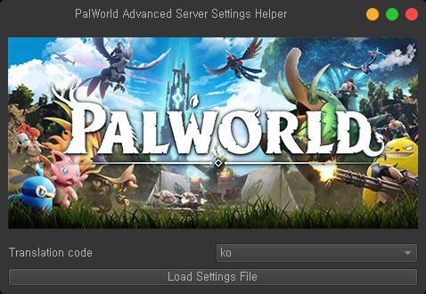
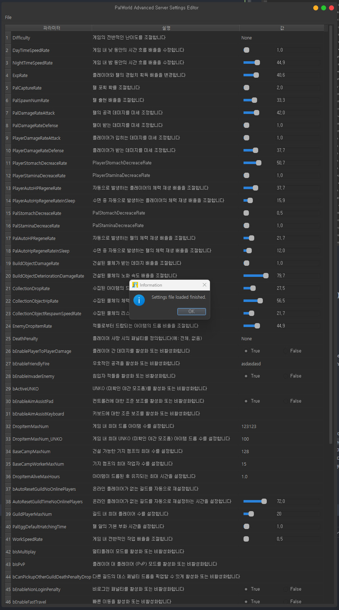
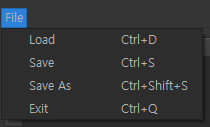
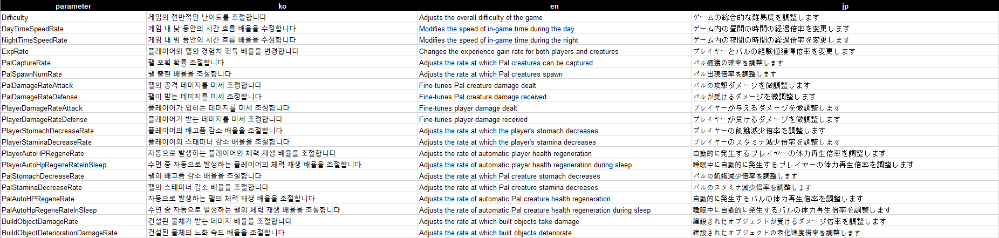
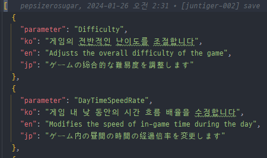
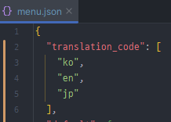

# python-palworld-editer


[](https://www.codefactor.io/repository/github/pepsizerosugar/python-palworld-editer)


* Palworld server setting file editor GUI
* This is not a generate server setting file, just editor for the server setting file that you already have.
* Make with
    * Python [3.10.0](https://www.python.org/downloads/release/python-3100/)
    * [PyQt5](https://github.com/PyQt5) GUI library
    * [qtmodern](https://github.com/gmarull/qtmodern) theme

<br>

<br><br>

## 0. Change Log

### version 1.0.1 (2024.01.29)

* Commit history
    * [juntiger-012] feat: 1.0.1
* Upcoming feature (#To-do)
    * Translation
    * More intuitive UI
    * More stable code
    * Diff between two server setting files
    * Diff before and after editing

<br>

## 1. Getting Started

### 1-1. Installation

1. Download the latest version from [GitHub](https://github.com/pepsizerosugar/python-palworld-editer/releases) or Clone
   the repository.
    1. ```git clone https://github.com/pepsizerosugar/python-palworld-editer.git```

2. Build Main.py using build.bat or just run.
    1. When build is finish, you can run the PalEditor.exe in the dist folder.

3. Or downaload the latest binary file what name "PalEditor.zip"
   from [GitHub](https://github.com/pepsizerosugar/python-palworld-editer/releases) and unzip it.
    1. Run PalEditor.exe

### 1-2. How to use

* 1-2-1. Load server setting file
    * 

    1. Click the "Translation code" drop down menu and select the language you want to translate.
        1. From now, only English, Korean, and Japanese are supported.
    2. Click the "Load Settings File" button.
    3. Select the server setting file you want to edit. (PalWorldSettings.ini)

* 1-2-2. Load settings
    * 

    1. If loaded successfully, the server settings will be displayed in the table.

* 1-2-3. Edit settings
    1. Edit the settings you want to change.
    2. Click the "File" menu at the top left of the window and select "Save" or "Save As" to save the edited settings.
        1. 
        2. Or Just press Ctrl + S to save the edited settings, or Ctrl + Shift + S to save the edited settings as a new
           file.
        3. If you want to save the settings as a new file, enter the file name you want to save in the pop-up window and
           click
           the "Save" button.
    3. If you want to load another server setting file, click the "File" menu at the top left of the window and select "
       Load
       Settings File" or press Ctrl + D.
    4. If you want to exit the program, click the "File" menu at the top left of the window and select "Exit" or press
       Ctrl + Q.

## 2. Extra

### 2-1. Translation

* If you want to translate the program into another language, you can translate it by editing the translation file.
* The translation file is located in the "resource" folder and the file name is "translations.xlsx" or "
  translations.json".
* translations.xlsx is the better way to translate because you just run exelTojson.py after you add the new column
  and input the translation. and then, translation json is automatically updated.
  * 
  * 
* And, Add the translation code to the "translation_code" list in the "menu.json" file.
  * 

### 2-2. Reference

* Qt API Doc (English): https://doc.qt.io/
* Qt 5 for Python Doc (English): https://doc.qt.io/qtforpython-5/
* PyQt5 Official Doc (English): https://www.riverbankcomputing.com/static/Docs/PyQt5/
* PyInstaller Doc (English): https://pyinstaller.readthedocs.io/en/stable/usage.html
* Python Official Doc (English): https://docs.python.org/3.9/
